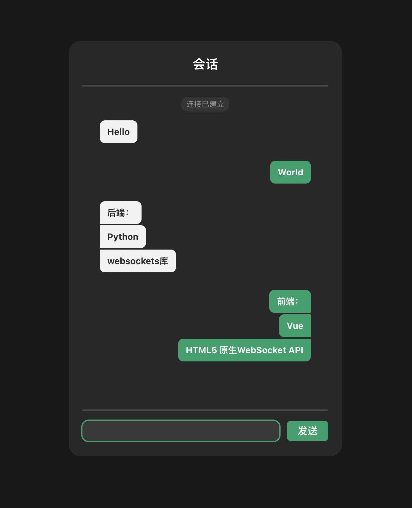

# WebSocket (Python-Vue) Case
## 用Python和Vue写的一个小WebSocket练习案例

### 简介
后端是利用Python的Websockets库写的简易服务端，接收纯文本消息，并能通过键盘输入消息发送给前端，消息收发均是异步的

前端是Vue实现的仿聊天窗口的页面⬇️



**不过大概也就`wsclient/src/components/WSChat.vue`有点用，可以直接抄了省时间(＞_＜)**

### 使用
#### 后端
```
pip install websockets
python server.py
```
#### 前端
```
cd wsclient
npm install
npm run dev
```